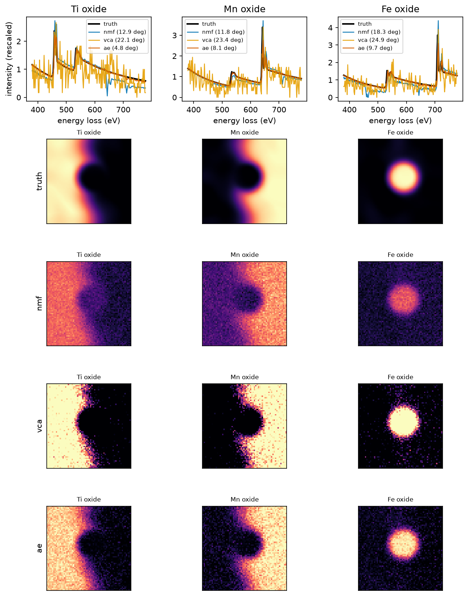

# eels-spectrum-unmixing

A ground-truth benchmark for spectral unmixing of STEM-EELS spectrum images.
It simulates a three-phase oxide scene (Ti, Mn, and Fe oxides meeting at a
diffuse interface, all sharing the O K edge) with exact known endmembers and
abundance maps, then asks how well PCA, NMF, VCA, and a constrained
linear-unmixing autoencoder recover them under the things that actually limit
core-loss mapping: Poisson dose, energy drift, spectral overlap, a wrongly
chosen component count, and initialization luck. Real spectrum images never
come with ground truth, which is precisely why the benchmark is synthetic;
every committed number regenerates from a fixed-seed config.



## Headline results

Full tables and readings in [RESULTS.md](RESULTS.md); raw values in
`results/*.json`. At the headline operating point (dose 200 counts per pixel
spectrum, 1.5 channels drift, three scene seeds), mean spectral angle to the
true endmembers after optimal matching:

| Method | SAD (deg) | Abundance RMSE |
|---|---|---|
| NMF (nndsvda, converged) | 17.2 +/- 0.6 | 0.259 |
| NMF, best of 10 restarts | 17.3 +/- 0.5 | 0.260 |
| VCA + constrained NNLS | 44.3 +/- 0.9 | 0.354 |
| Autoencoder (simplex + non-negativity constraints) | **8.5 +/- 0.7** | **0.166** |

Five findings, measured, not asserted:

1. **The constraints earn their keep at low dose.** The autoencoder, whose
   decoder is the linear mixing model itself (softmax abundances, softplus
   endmembers), halves NMF's endmember error at dose 200 and leads at every
   dose from 10 to 5000. The gap is not subspace quality, which all methods
   share; it is where the endmembers land inside it.
2. **The high-dose floor is drift, not photons.** Above dose 1000 every
   method saturates; removing energy drift drops the autoencoder from ~7 to
   2.7 deg. A drifted spectrum is not a linear mixture, and no factorization
   fixes that. Align first, unmix second.
3. **The autoencoder's failure mode is collapse, and it is detectable.**
   Across 10 seeds, 7 land at 7.5 deg and 3 collapse onto a two-component
   solution at ~17 deg. The collapsed runs sit 11% higher in reconstruction
   error, so best-of-N selection by fit alone reliably rejects them; among
   healthy runs, fit error cannot rank recovery at all (best-of-N changes
   nothing).
4. **Training length is a real, undetectable-from-fit hyperparameter.**
   Reconstruction error falls monotonically with epochs while recovery peaks
   at 1200 and then degrades by 6 deg (figures/ae_epochs.png). The shipped
   default sits at the best sampled setting and RESULTS.md says so plainly,
   because nothing inside the method would find it on real data.
5. **Overlap hurts the maps before the spectra.** Compressing the Mn L3 to
   Fe L3 separation from 68 to 8 eV costs the autoencoder only ~3 deg of
   endmember angle but triples its abundance error; ill-conditioning shows
   up in the maps first.

The classical baseline was audited before crediting any of this: NMF
converges below its iteration cap, a 4x cap changes nothing, KL-divergence
NMF is worse than the Frobenius default on this problem, restarts do not
help, and neither Poisson noise-whitening nor bolting the sum-to-one
constraint onto NMF closes the gap (`scripts/fair_tuning_check.py`,
`results/fair_tuning.json`).

## What is in the box

- **Simulator** (`eelsunmix.sim`): endmember spectra built from power-law
  backgrounds and ionization edges at tabulated energies (Ti L2,3 456 eV,
  O K 532 eV, Mn L2,3 640 eV, Fe L2,3 708 eV) with Gaussian white lines and
  per-element L3/L2 ratios; a two-grain-plus-precipitate scene with a wavy
  diffuse interface; smooth per-pixel energy drift; Poisson noise set by one
  dose parameter. Exact endmembers, abundances, and drift field returned
  with every cube.
- **Methods** (`eelsunmix.methods`, `eelsunmix.autoencoder`): PCA (SVD),
  NMF (scikit-learn, with a restart protocol), a from-scratch VCA with
  simplex-constrained NNLS abundances, and a PyTorch autoencoder whose
  decoder is the linear mixing model (24,699 parameters; committed weights
  and [model card](models/MODEL_CARD.md)).
- **Scoring** (`eelsunmix.metrics`): spectral angle with optimal Hungarian
  matching, sum-to-one abundance RMSE, and principal-angle subspace error,
  with PCA scored for what it actually estimates.
- **Benchmark harness** (`eelsunmix.benchmark`): four modes driven by seven
  fixed-seed YAML configs in `configs/`; each JSON in `results/` and figure
  in `figures/` regenerates from one config.

## Install

Python 3.11. CPU-only PyTorch is sufficient for everything here.

```
python -m venv .venv
.venv\Scripts\activate          # Windows; source .venv/bin/activate elsewhere
pip install torch --index-url https://download.pytorch.org/whl/cpu
pip install -e ".[dev]"
```

## Quickstart

```
eelsunmix demo                                        # committed model on the committed sample
eelsunmix simulate --dose 200 --output scene.npz --figure scene.png
eelsunmix unmix scene.npz --method ae --figure overlay.png
eelsunmix benchmark configs/operating_point.yaml      # any committed benchmark
eelsunmix train --dose 1000 --epochs 1200 --output model.pt
python scripts/run_all.py                             # every table and figure, ~40 min CPU
```

The tutorial notebook (`notebooks/tutorial.ipynb`, committed executed) walks
from simulation through rank selection, all three unmixing families, and the
final scoring, with a figure at every step. The Python API is documented
with runnable examples in [docs/api.md](docs/api.md).

## Your own data

No real spectrum image is committed: openly licensed experimental EELS maps
are rare and nothing with unclear provenance ships here. The library runs on
any `(ny, nx, energy)` cube saved as `.npy`/`.npz`, without ground truth:

```
python examples/unmix_your_own_map.py your_map.npz --k 3 --method nmf
```

`docs/api.md` and `examples/unmix_your_own_map.py` document the loader, the
HyperSpy conversion snippet for vendor formats, and the preprocessing that
matters (non-negative counts, crop to the core-loss region of interest).
EDX spectrum images fit the same linear mixing model and run unchanged.

## Repository layout

```
src/eelsunmix/      sim, methods, autoencoder, metrics, benchmark, plots, io, cli
configs/            seven fixed-seed YAML benchmark configs
results/            one JSON per config, plus the fair-tuning audit
figures/            regenerable figures for every config
models/             committed autoencoder weights + model card
data/sample/        one committed synthetic sample with full ground truth
notebooks/          executed tutorial notebook
docs/, examples/    API documentation, bring-your-own-data recipe
scripts/            run_all, make_figures, build_notebook, fair_tuning_check
tests/              59 pytest tests
```

## Scope and limitations

- Everything is simulation, and the physics is deliberately minimal: linear
  mixing of three endmembers, power-law backgrounds, sigmoid edge onsets
  with Gaussian white lines, Poisson noise, smooth energy drift. No plural
  scattering, no spectrometer point-spread function, no channel gain
  variation, no thickness effects. Absolute numbers will not transfer to
  any instrument; the method ranking and failure modes are the transferable
  part.
- The autoencoder is fit per cube, like NMF, not trained once and deployed;
  the committed weights exist so the demo runs instantly and are valid only
  for the committed sample.
- Unmixing here means recovering endmembers and abundances. Quantification
  (cross-sections, thickness, absolute composition) is out of scope.
- VCA is scored with its standard assumptions; scenes here have near-pure
  but not pure pixels, which is part of what is being measured.

## Author

Aamir Malik

- GitHub: https://github.com/aamirmalik-dr
- LinkedIn: https://linkedin.com/in/dr-aamirmalik

## License

MIT for all code and all committed (synthetic) data. See [LICENSE](LICENSE).
